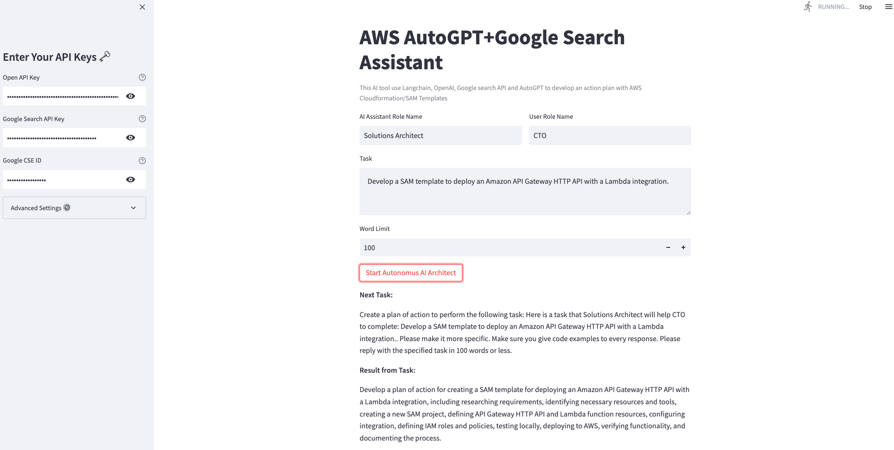

# Overview

The app creates an action plan to complete the user's tasks and searches Google for information to keep itself up to date.
This is a BabyAGI + Google Search API tool that uses Langchain's framework hosted on Streamlit.

## Methodology

We take the user's input and make a prompt for the LLM based on the assistant's role (the LLM that is meant to answer) and the user's role (the person who is asking the question).

For Langchain to produce the right results, more prompt templates are needed.

---
Access app here: https://dheerajinampudi-ai-architect-streamlit-app-r3ui99.streamlit.app/



# Sample results GIF


## To run

Then run the following commands:

```
python -m venv venv
source venv/bin/activate
pip install -r requirements.txt
streamlit run streamlit_app.py

```

If streamlit is not working, checkout their [installation page](https://docs.streamlit.io/library/get-started/installation)

---

### Develop

1. BabyAGI + Google Search API App

2. UI inputs types
   - AI Role
   - User Roles
   - Task type

---

### TODO

- [ ] Need to improve prompt formation
- [ ] Need to format the output into relevant formats
- [ ] Need to add AI Role dropdown
- [ ] Need to add User Role dropdown
- [ ] Need to add Task Type dropdown

---
### Inspired by

- https://discuss.streamlit.io/t/free-autogpt-a-powerful-ai-agent-without-paid-apis-with-streamlit/41576

## Disclaimer

This study is a proof of concept developed to determine if an LLM and personalized prompt templates can outperform a generic model. It is not ready for use in production and was not designed for that purpose.
